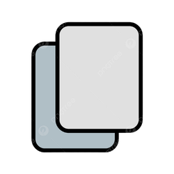

# 📋 softwarencodercopylist
<div align="center">
  
  <br>
  <p><b>A lightweight native clipboard manager for macOS</b></p>
  <p><b>macOS için hafif ve doğal bir pano (clipboard) yöneticisi</b></p>
</div>

---

<div align="center">
  <a href="#english">🇬🇧 English</a> &nbsp;|&nbsp; <a href="#turkish">🇹🇷 Türkçe</a>
</div>

---

<br>

<h2 id="english">🇬🇧 English</h2>

**softwarencodercopylist** is a super lightweight menu bar application for macOS that keeps track of everything you copy. Built entirely with native Swift and AppKit, it sits quietly in your menu bar and remembers your last 100 clipboard entries.

### ✨ Features
- **🚀 Native & Fast:** Built entirely with Swift and AppKit – no heavy electron frameworks!
- **🗂️ 100 Item History:** Keeps track of your last 100 copied strings.
- **🖱️ Menu Bar App:** Lives seamlessly in your macOS menu bar. 
- **🧹 Easy Clear:** One click to clear your entire clipboard history.
- **🚫 Background Focused:** Operates without a distracting dock icon.
- **🎨 Custom Icon:** Features a beautifully custom `copy.png` integrated icon.

### 🛠️ Installation
Currently, you can build this natively using the provided shell script without needing Xcode!

1. Clone this repository:
   ```bash
   git clone https://github.com/yourusername/softwarencodercopylist.git
   ```
2. Run the build script:
   ```bash
   cd softwarencodercopylist
   sh build.sh
   ```
3. Locate the `softwarencodercopylist.app` file and double click it! 🚀

### 💻 Technologies Used
- Swift
- AppKit (Cocoa)
- macOS Menu Bar API (`NSStatusItem`)
- Bash Scripts (For `.icns` creation and compilation)

---

<br>

<h2 id="turkish">🇹🇷 Türkçe</h2>

**softwarencodercopylist**, macOS için geliştirdiğim süper hafif bir üst menü çubuğu (menu bar) uygulamasıdır. Kopyaladığınız her şeyi takip eder. Tamamen macOS'un kendi yerel dili Swift ile geliştirilmiştir ve son 100 kopyalama işleminizi hafızasında tutar.

### ✨ Özellikler
- **🚀 Ultra Hızlı:** Tamamen Swift ve AppKit ile kodlandı – ağır web tabanlı (Electron vb.) teknolojiler içermez!
- **🗂️ 100 Öğe Hafızası:** Kopyaladığınız en son 100 metni sizin için saklar.
- **🖱️ Menü Çubuğunda Yaşar:** Mac'inizin sağ üst köşesindeki menüye gizlice yerleşir, kalabalık yapmaz.
- **🧹 Tek Tıkla Temizlik:** Hafızayı anında sıfırlama seçeneği.
- **🚫 Dock'u İşgal Etmez:** Alt taraftaki (Dock) uygulama simgelerinizin arasında kalabalık yaratmaz. Arka planda sessiz çalışır.
- **🎨 Özel İkon:** `copy.png` tabanlı özel menü ikonu.

### 🛠️ Kurulum ve Kullanım
Bu projeyi derlemek için devasa Xcode'u kurmanıza gerek yok, sadece komut satırı yeterli!

1. Projeyi bilgisayarınıza indirin (clone):
   ```bash
   git clone https://github.com/yourusername/softwarencodercopylist.git
   ```
2. Derleme script'ini çalıştırın:
   ```bash
   cd softwarencodercopylist
   sh build.sh
   ```
3. Oluşan `softwarencodercopylist.app` uygulamasına çift tıklayarak çalıştırın! 🚀

### 💻 Kullanılan Teknolojiler
- Swift dökümanı
- AppKit (Cocoa)
- macOS Menu Bar API (`NSStatusItem`)
- Shell / Bash Scripts (İkon oluşturma ve `.app` derleme işlemleri için)

---

<div align="center">
  <br>
  <i>Developed with ❤️ for macOS | macOS için ❤️ ile geliştirildi</i>

  
</div>